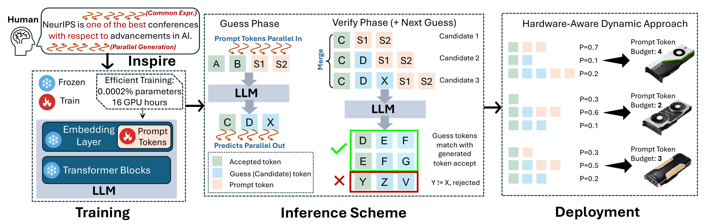
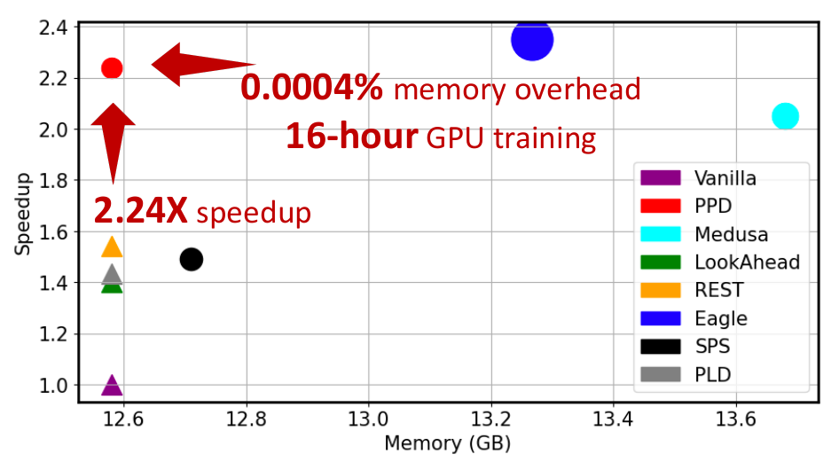
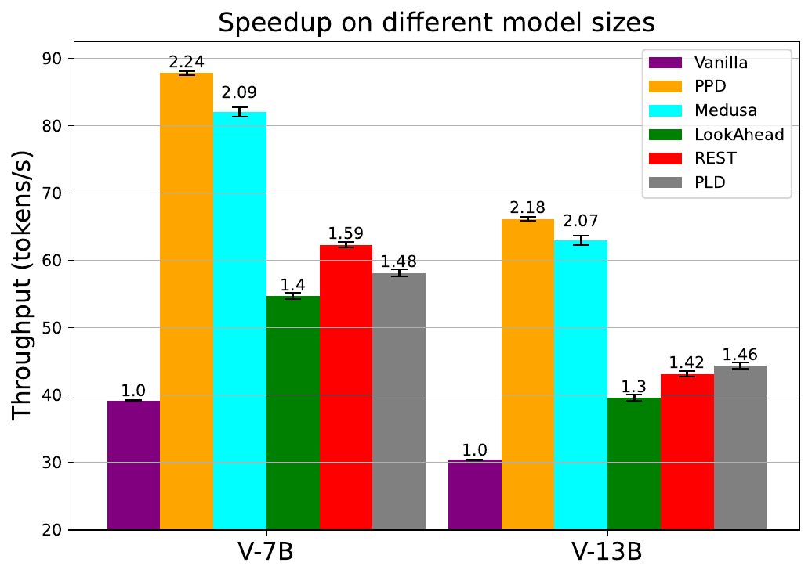

<div align="center"><h1>Parallel Prompt Decoding: Accelerate LLM Inference with Parallel Prompting</h1></div>

**PPD** (Parallel Prompt Decoding) is a cost-efficient method to accelerate LLMs with trained appended prompt tokens. Our technique stands out for three key features: 
- *Orthogonal Optimization*: Orthogonal to speculative decoding, PPD provides the potential for synergistic integration.
- *Memory Efficiency*: With a minimal runtime memory overhead of just 0.0004%, PPD is highly suitable for edge and mobile settings.
- *Training Efficiency*: The training process isefficient, requiring only 16 hours on a single A100-40GB GPU.

<div align="center">
  <picture>
  
  </picture>
  <br>
  <div align="center" width="100%">
  <em>PPD on Vicuna-7b.</em>
  </div>
  <br>
</div>

The key intuition of **PPD** lies in the observation that if trained properly, prompt tokens appended to the input can approximate tokens generated at future timesteps, thereby partially recovering the missing conditional dependency information for multi-token generation.

<div align="center">
  <picture>
  
  </picture>
  <br>
  <div align="left" width="100%">
  <em>Inspired by the human natural language generation process where continuous words like common expressions and phrases are produced simultaneously, PPD introduces the use of prompt tokens for multi-token prediction. Specifically, these trained prompt tokens are appended to the original input sequence, enabling the concurrent generation of multiple output tokens in a single forward pass.</em>
  </div>
  <br>
</div>
<div align="center">
  <picture>
  
  </picture>
  <br>
  <div align="center" width="100%">
  </div>
  <br>
</div>

**PPD** is designed to address the following challenges faced by the current speculative decoding methods:

- Low step compression rate due to conditional independence assumption.
- High complexity and cost of training/maintaining draft models.
- Limited applicability in edge and mobile environments due to memory overhead.

Through extensive experiments across LLMs ranging from MobileLlama to Vicuna-13B on a wide range of benchmarks, our approach demonstrates up to 2.49 $\times$ speedup and maintains a minimal runtime memory overhead of just 0.0004%.

<div align="center">
  <picture>
  
  </picture>
  <br>
  <div align="center" width="100%">
  <em>Evaluated on a single A100 with MT-Bench.</em>
  </div>
  <br>
</div>

Our paper is available ([here](https://arxiv.org/abs/2405.18628v1))! If you found it helpful, pls cite us:
```
@article{hao2024ppd,
  title={Hardware-aware parallel prompt decoding for memory-efficient acceleration of LLM inference},
  author={Chen, Hao (Mark) and Luk, Wayne and Yiu, Ka Fai Cedric and Li, Rui and Mishchenko, Konstantin and Venieris, Stylianos I and Fan, Hongxiang,
  journal={arXiv preprint arXiv:2405.18628},
  year={2024}
}
```

## Contents

- [Installation](#installation)
- [Model Weights](#model-weights)
- [Dataset Generation](#dataset-generation)
  - [Truncated Dataset](#truncated-dataset)
  - [Distillation Dataset](#distillation-dataset)
- [Training Special tokens](#special-tokens)
- [Inference](#inference)
  - [Chat Application](#chat-application)
  - [MT Bench](#mt-bench)
  - [Alpaca Eval](#alpaca-eval)
  - [HumanEval](#humaneval)
  - [GSM8K](#gsm8k)

## Installation

```bash
git clone https://github.com/hmarkc/prompt-decoding.git
cd prompt-decoding
pip install -e .
```

## Model Weights

| Original Model                                                                  | PPD embedding weights                                                                       |
| ------------------------------------------------------------------------------- | ------------------------------------------------------------------------------------------- |
| [lmsys/vicuna-7b-v1.3](https://huggingface.co/lmsys/vicuna-7b-v1.3)             | [hmarkc/ppd-vicuna-7b-v1.3](https://huggingface.co/hmarkc/ppd-vicuna-7b-v1.3)               |
| [lmsys/vicuna-13b-v1.3](https://huggingface.co/lmsys/vicuna-13b-v1.3)           | [hmarkc/ppd-vicuna-13b-v1.3](https://huggingface.co/hmarkc/ppd-vicuna-13b-v1.3)             |
| [mtgv/MobileLLaMA-1.4B-Chat](https://huggingface.co/mtgv/MobileLLaMA-1.4B-Chat) | [hmarkc/ppd-MobileLLaMA-1.4B-Chat](https://huggingface.co/hmarkc/ppd-MobileLLaMA-1.4B-Chat) |

## Dataset Generation

### Truncated Dataset

With a given dataset, a random truncation is performed to reduce the contextual bias of the training of special tokens. Then, a distillation dataset is generated from the truncated dataset.

The truncated datasets need to be generated first. Here is how a dataset for 3 special tokens can be generated for the ShareGPT dataset.

```
python generate_dataset.py --dataset_type finetune --num_special_tokens 3 --data_path ShareGPT_V4.3_unfiltered_cleaned_split.json --model_max_length 2048
```

### Distillation Dataset

Then, we can generate the distillation dataset from the truncated dataset. `--data_path` is the path to the previously generated truncated dataset and `--model_name_or_path` is the model the distribution of which we want to obtain.

```
python generate_dataset.py --dataset_type distillation  --num_special_tokens 3 --data_path ShareGPT_training_dataset_3_finetune_2048.pt --model_max_length 2048 --model_name_or_path lmsys/vicuna-7b-v1.3
```

## Training Special tokens

Example script to train Vicuna-7b with distillation dataset named "ShareGPT_training_dataset_2_distillation.pt".

```
accelerate launch --num_processes 4 prompt/train/train.py --model_name_or_path lmsys/vicuna-7b-v1.3 \
    --dataset_path "./ShareGPT_training_dataset_2_distillation.pt" \
    --output_dir test/ \
    --num_train_epochs 1 \
    --save_steps 500 \
    --model_max_length 2048 \
    --num_special_tokens 3 \
    --virtual_tokens_per_special_token 1 \
    --per_device_train_batch_size 1 \
    --per_device_eval_batch_size 1 \
    --gradient_accumulation_steps 4 \
    --evaluation_strategy "no" \
    --learning_rate 1e-2 \
    --weight_decay 0.0 \
    --warmup_ratio 0.0 \
    --lr_scheduler_type "cosine" \
    --logging_steps 10 \
    --load_in_4bit \
    --vt_attention_type "ensemble" \
    --trainer_type "distillation_trainer"
```

You need to change the `--dataset_path` to the location of the distillation dataset and specify `--trainer_type` as "distillation_trainer" to train with knowledge distillation. `--num_special_tokens` specifies the number of special tokens for training. `--virtual_tokens_per_special_token` is the number of virtual tokens used for 1 special token, which should be set to 1 to achieve the lowest latency results.

## Inference

We employ a dynamically extended tree attention and top K candidates for inference. The supported evaluation datasets currently include [Alpaca Eval](https://huggingface.co/datasets/tatsu-lab/alpaca_eval/blob/0cd24d711fe90d0c1aae5bde03fe98ee48ae52f8/alpaca_eval.json), [MT Bench](https://github.com/lm-sys/FastChat/tree/main/fastchat/llm_judge), and [HumanEval](https://github.com/openai/human-eval).

Refer to this [README.md](application/README.md) on how to install libraries for these datasets.

### Chat Application

We implemented a simple chat application using `gradio`. To start a server for the chat application, run `python application/webui.py --ppd-path <ppd-model-path>`.

### MT Bench

- To obtain the latency of the baseline model (without the use of special tokens), run

```
python3 gen_model_answer_baseline.py
  --model-path <model-path>
  --model-id <model-id>
  --answer-file <output-file>
  --bench-name mt_bench
  --temperature <temperature>
```

- To obtain the latency of the model with special tokens, run

```
python3 gen_model_answer_prompt_decoding.py
  --model-path <model-path>
  --model-id <model-id>
  --answer-file <output-file>
  --tree-length 105
  --bench-name mt_bench
  --temperature <temperature>
```

`--model-path` is the path to the trained special tokens and `--tree-length` is the length of the sparse tree used.

- To view the latency results of a generated `.jsonl` file, run

```
python get_throughput_results.py data/mt_bench/experiments/vicuna-7b-faster1.jsonl --n 3
```

`--n` specifies the number of experiment runs to get the average of.

### Alpaca Eval

We use Alpaca Eval dataset as the evaluation dataset. The latency results can be obtained using the same script as MT Bench and adding `--bench-name alpaca_eval`.

- To compare the latencies and accept lengths between sparse trees with different sizes, run:

```
python accept_length.py \
  --dir-path <output-dir> \
  --file-name <file-name> \
  --model-name <model-path> \
  --eval-file-name gen_model_answer_prompt_decoding.py \
  --n 1 \
  --max-length 120 \
  --min-length 60 \
  --length-interval 9 \
  --choices "[75, 105, 135, 165, 195, 225, 255, 285]" \

python3 tree_latency.py \
  --model-path <model-path> \
  --model-id <model-id> \
  --answer-file <output-file> \
  --bench-name alpaca_eval \
  --min-tree-length 60 \
  --max-tree-length 120 \
  --length-interval 3 \
  --max-new-token 1024
```

This [script](script/latency/optimal-sparse-tree.sh) runs the latency tests on a range of sparse trees.

### HumanEval

The latency results of HumanEval can be obtained using the same script as MT Bench and adding `--bench-name humaneval`.

### GSM8K

The latency results of GSM8K can be obtained using the same script as MT Bench and adding `--bench-name gsm8k`.

